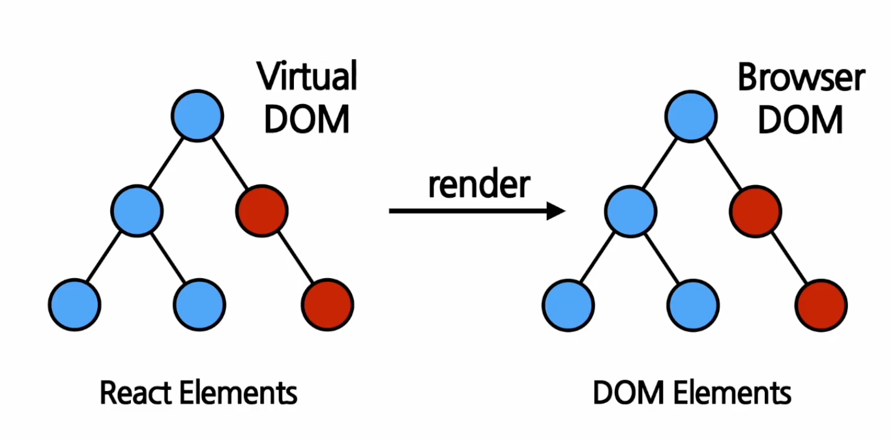
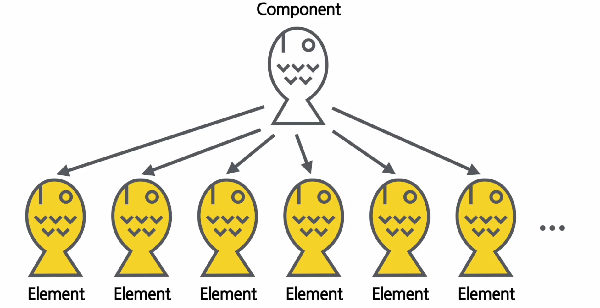
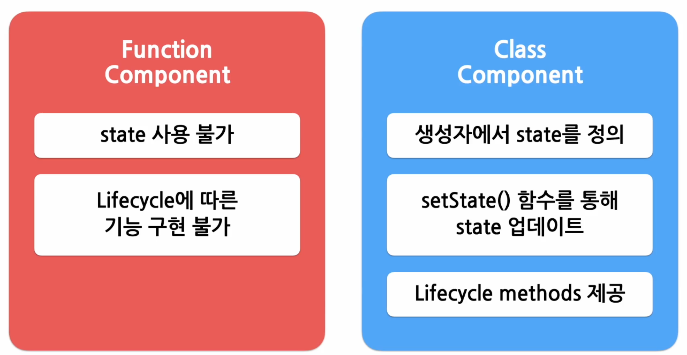
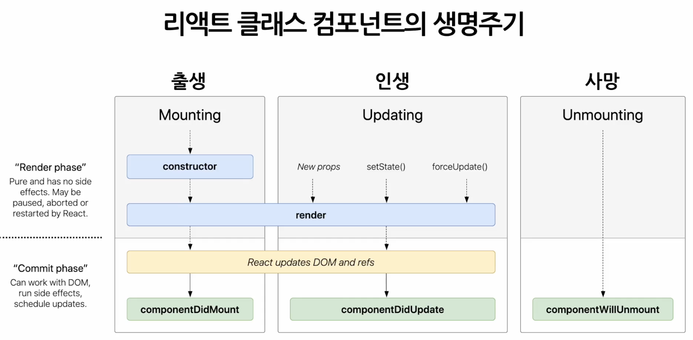
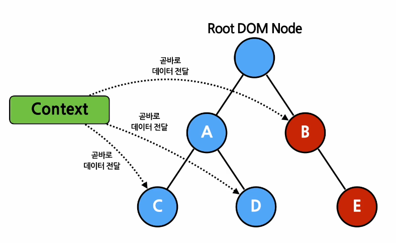

# cra

`create-react-app` 으로 생성한 프로젝트.
```shell
$ npx create-react-app cra
```

# Run

```shell
$ npm start
```

# Theory

## Rendering


* ***Rendering 과정을 통해서 `virtual DOM` 의 react element 를 `DOM` 의 html element 로 변환한다.***
* react element: 단순 javascript 객체
* react element 는 생성 후 children, attribute 를 바꿀 수 없다.
* 따라서 react element 를 업데이트하기 위해서는 다시 생성해야 한다.

## Components & props

* React 는 `component` 기반이고 모든 페이지는 component 로 이루어져있다.

* `props`: react component 의 속성. 같은 component 라고 하더라도 props 에 따라 다른 element 가 된다.
  * `read-only`, 값을 변경할 수 없음. 붕어빵이 구워졌는데 속재료를 바꿀 수 없음. 만약 바꾸고 싶다면 새로운 element 를 생성해야 함.
* 모든 react component 는 그들의 props 에 대해서 pure 함수 역할을 해야 한다.
  * 즉, component 는 자신의 props 를 내부적으로 변경해서는 안된다.
  * 같은 props 에 대해서는 같은 결과를 보여줘야 한다.
* function component, class component
  * function component 가 주로 사용된다.


## State & Lifecycle

* `state`: react component 의 변경 가능한 데이터.
  * state 가 바뀌면 component 가 다시 rendering 되므로 state 는 최소화해야 한다.
* `state` 는 직접 수정할 수 없다. 
```js
// X
this.state = {
  name: 'Inje' 
}
// O. setState 를 이용해서 수정해야 한다.
this.setState({
  name: 'Inje'
})
```

* component 의 `life cycle`

* 상위 컴포넌트가 하위 컴포넌트를 보여주지 않을 때 unmount 된다.

## Hooks

`Hook`: function component 에서 state 를 사용할 수 없는 점을 해결하기 위해 도입.
* `useState`: state 를 사용하기 위한 hook.
* `useEffect`: function component 에서 side effect 를 실행할 수 있게 해주는 hook.
```js
useEffect(() => {
  // 컴포넌트가 마운트 된 이후 또는
  // 의존성 배열에 있는 변수들 중 하나라도 값이 변경되었을 때 실행
  // 의존성 배열 생략 시 컴포넌트 업데이트될 때 마다 실행됨.
  // ...
  return () => {
    // 컴포넌트가 마운트 해제되기 전에 실행됨
    // ...
  }
}, [var1, var2, var3]);
```
* `useMemo`: memoized value 를 리턴하는 hook
```js
const memoizedValue = useMemo(
  () => {
    // 연산량이 높은 작업을 수행하여 결과를 반환
    return computeExpensiveValue(var1, var2)
  },
  // 의존성 배열 생략 시 매 렌더링마다 함수가 실행 됨.
  // 빈 배열일 경우 컴포넌트 마운트 시에만 호출 됨.
  [var1, var2]
)
```
* `useCallback`: `useMemo()` 와 유사하지만 값이 아닌 함수를 반환한다.
* `useRef`: reference 를 사용하기 위한 hook
  * reference: 특정 컴포넌트에 접근할 수 있는 객체
```js
const refContainer = useRef(initialValue);
```
* hook 의 규칙
  * hook 은 무조건 최상위 레벨에서 호출되어야 한다.
  * hook 은 렌더링할 때마다 동일한 순서로 호출되어야 한다.
  * hook 은 함수 컴포넌트에서만 호출해야 한다.
* `custom hook`: 이름이 use 로 시작하고 하나 이상의 다른 hook 을 호출하는 함수.

## Events

버튼 클릭 이벤트 등.

## Context

* props 를 통해 데이터를 전달하는 것은 불편하다 (예를 들어 여러 컴포넌트가 겹쳐 있는 경우).
* 이를 위해 context 도입.


